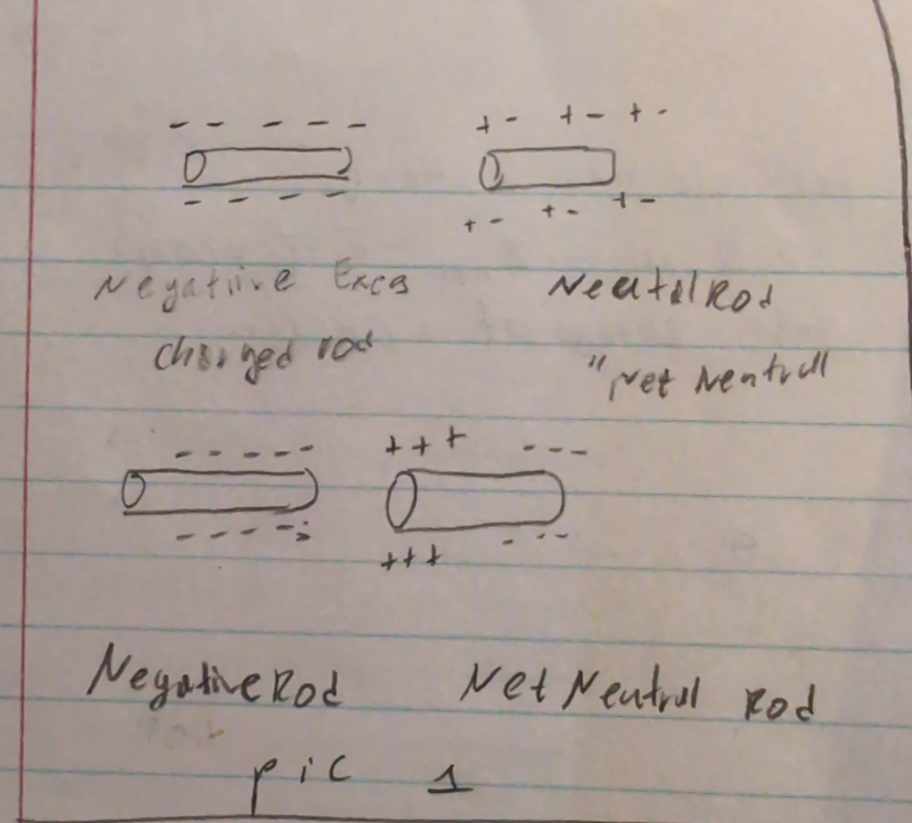

# Electrostatics

```statics means slowly```

ENM - Electromagnetics or Electromagnetic Theory

## Electric Chargers
Two types of charges:
    Positive (`+`) charge
    Negative (`-`) charge

Any particle with some amount of positie or negative charge is considered a charged particle.

Example of particles includes Proton (`+`) & electron (`-`)

**Note**: There is a third charge called Nautral.

Netural charge definitions:
> Defn 1: *Neutral* is when no charge (particle with no charge)

> Defn 2: *Neutral* is when 2 oposite charges cancel each other often called **Net-Neutral**


positive (`+`) charted particles

### Idealized Charged Particles
Most charged particles ahve dimention to them, taking some volume. This can be ahrd to model; therefore, we idealize the model, forcing charged particles to be *point charges*

**A point charge** is a simplification of a particle such that it only is a small dot that contains all charge with in it. A single point with all mass and charge at that point COM[^1]

**Note**: Charge particle or point charge mean the smae thing moving father.

### Forces Associated with charged particles
* Repulction force - two similar charges close together experience a pushing force.
  [+ <--  --> +]
* Attractio nforce - two particles are different charges and feel a pulling force.
  [+ --> <-- -]

### Conductor and Insulator
All materials/materials in real life are comprised of charged particles. <br>
Most materials are eletrically neutral, not because they have proton or electron, but that the charge of their protons and eletrons cancel eveating a net neutral charge.

Materials can give extra or lose some charge to make it slightly charged and some materials do this better then other.

**Conductor**, are materials that allow charge to move freely or flow easily though the material.<br>
When ocnductors gain excess charge they spread the charge evenly thouhg out.<br>
> e.g. coper is a good conductor

**Note**: Conductor hold all thier excess charge at the *surface* of the material.

**Insulators**, are the oposite of condutors. They resist or restrict charges from flowing or moving freely
> e.g. glass rubber wood

**Semi-conductor**, are combination of conductors and insulators. Thye allow some free flowing and some restriction. Mostly used in eletronics.
> e.g. silicon

**Super conductors**, are idealized conductor. Charges move or spread at very high velocities with no resistance.

### Induced Charge

```Induce means Create```

Most if not all materials want to be neutral.<br>
How do materials get this excess charge then?

**Induced Charge** is the interaction between charged materials or neutral materials whta experience and eletrical force and redistribute/sharing of charges.

Assume a negatively charged rod gets close to a net-netural rod




The negative rod attracts the positive charges in the neutral charge, and repell the negative charge.

**Note**: The neutral rod is still neutral, but now has a *positive pole* and *negative pole*


## Take out
There are two types of charge
  - **positive** (+)
  - **negative** (-)

And the there is third type **neutral** charge

neutral charge has two definition.
  - neutral becuase the particle by it's nature doesn't have charge
  - neutral (net-neutral) because two or more particles negate each others charge.

In this course particles are **Idealized** - meaning they have no dimentions (they are just a point). It is also known as **a point of charge** which is located in COM

There are two type of forces:
  - repulsion (same charge)
  - atraction (opposite charges)

All matrerials are made of charged particles.
Materials can transfer energy with each other.

**Conductor** allow charge to flow freely or with little resistance<br>
**Insulator** resisst the charge to flow though it<br>
**Semi-conductor** allow and don't allow to flow the charge<br>
**super conductors** charge particles flow in a high velocity

inducing charge (creaing charge) by interacting of charged material with net-neutral material.
which can create poles (positive and negative)

[^1]: COM - center of mass

---

## Footer

[Open Another File](lect2%20Electrostatic%20prt%202.md)

---

