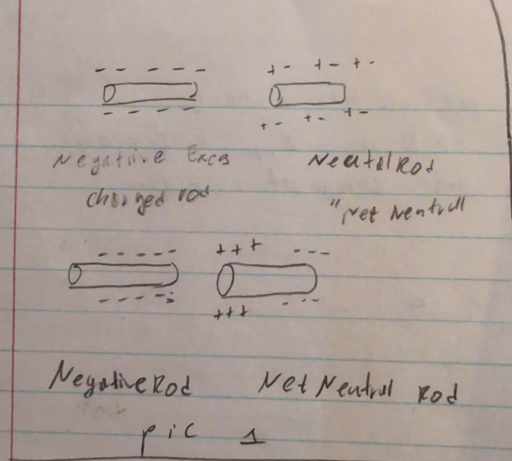
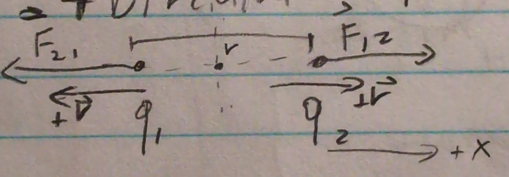
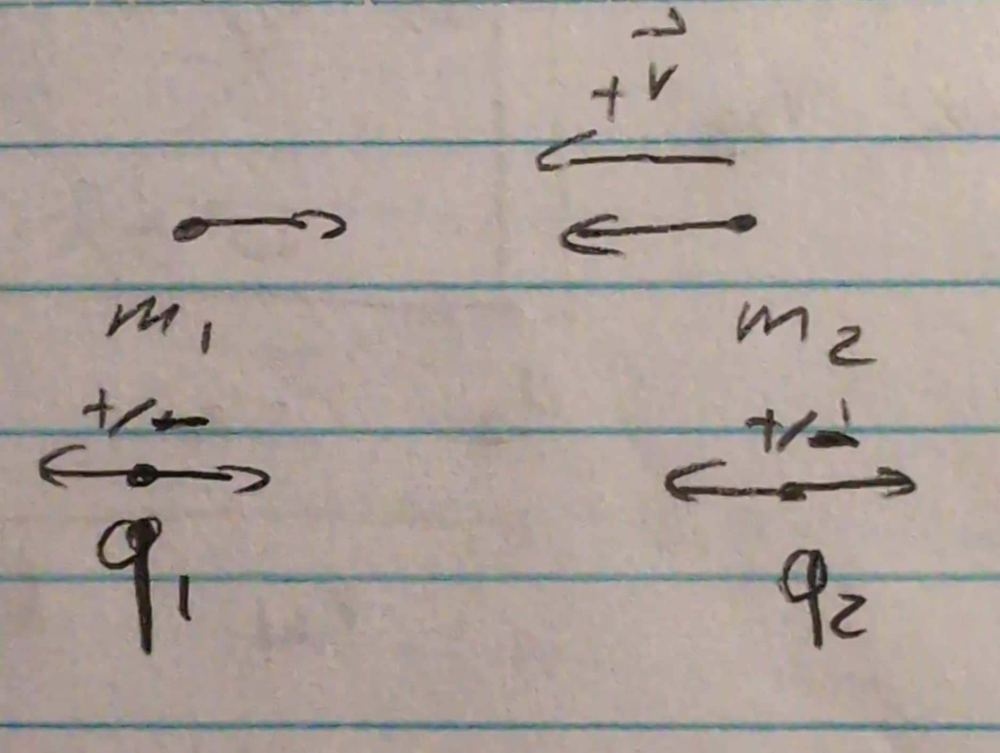
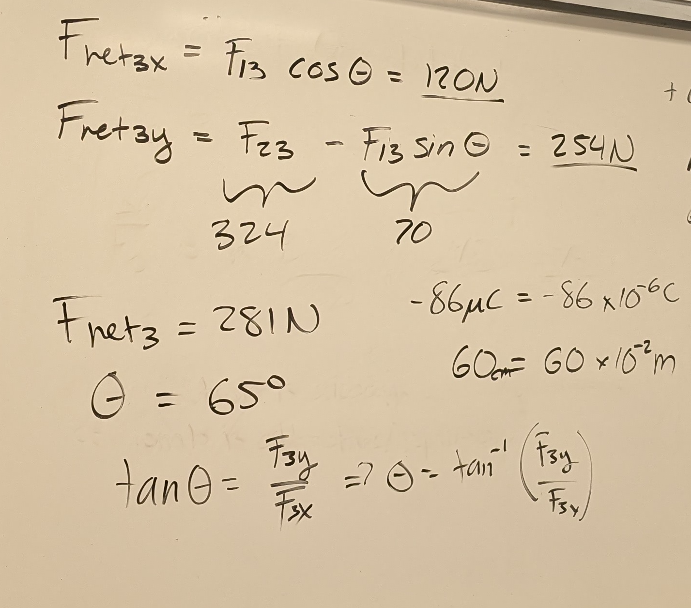
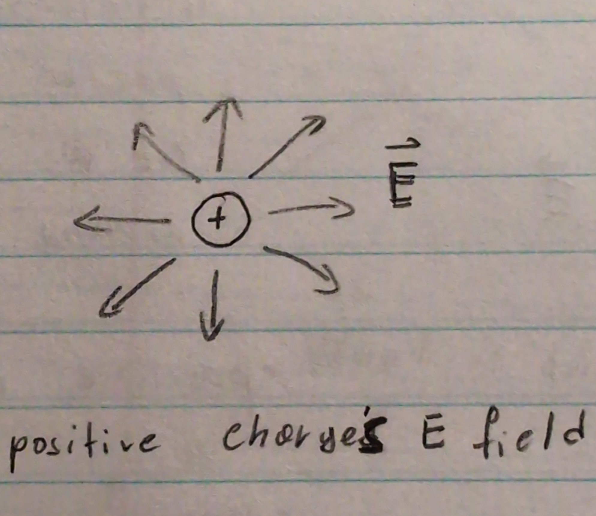
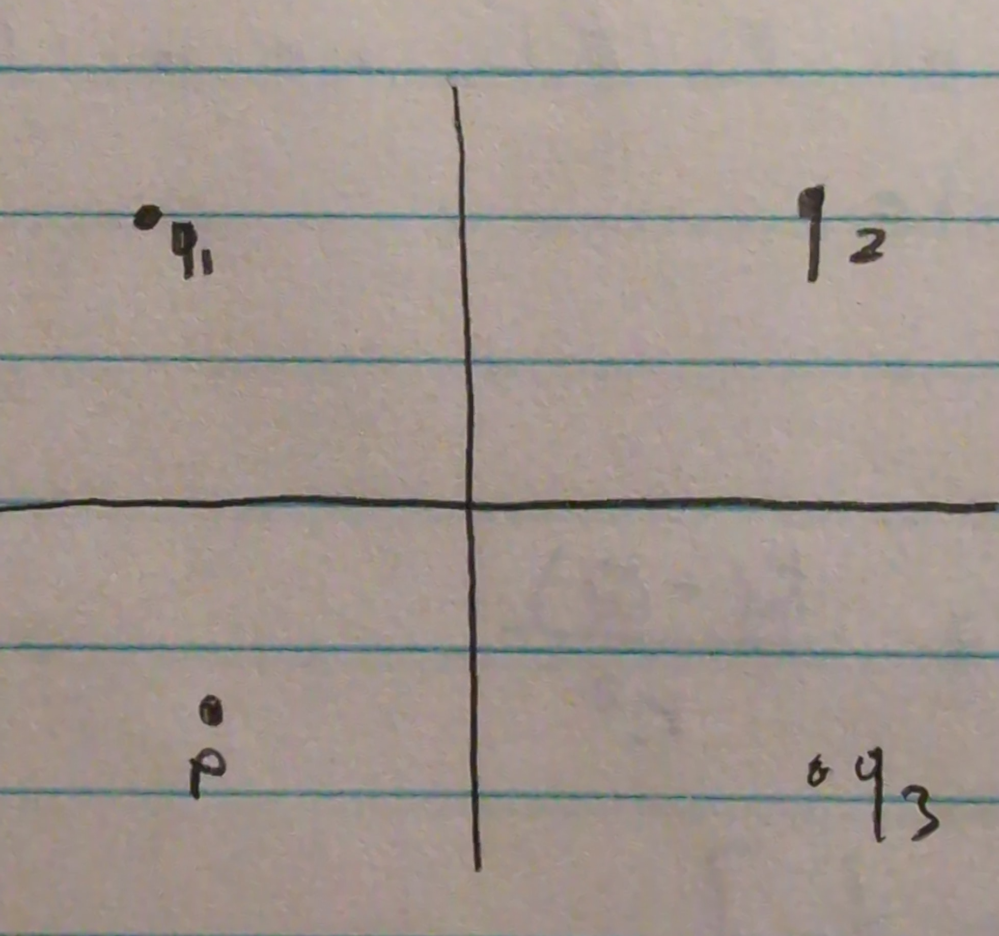
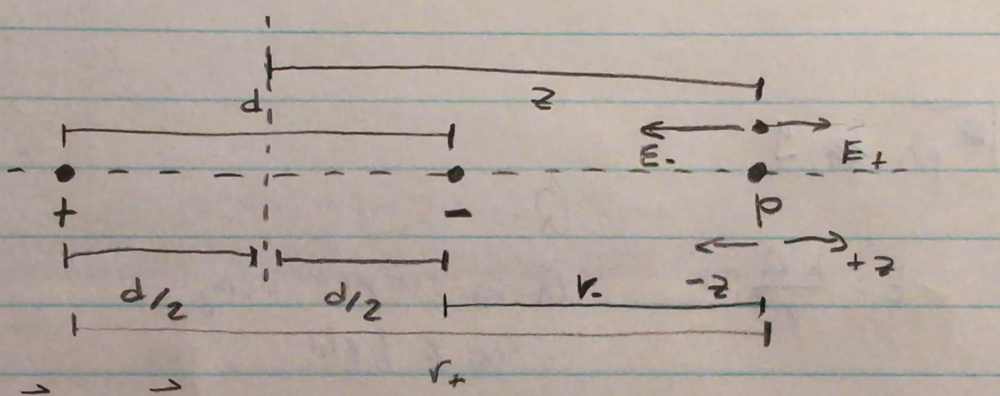

# Lab Lecture

```This will be a lab lecture, next week will be the first lab and  a quiz based on the todays lecture.```

## Revieww
### Induced charge

------------
Negative Excess Charged Rod



Redistribution of charge can create induced charge.
> ex. Induced charge is created at the ends of the net neutral Rod

**Note**: net neutral rod is still net neutral because the rod still has the same number of "+" and "-"

Another way to induce chare is physically touch the two objects.


After toucing the spehre quickly exchange electrons, leaving both sphere to be in balance or equally distributed positive chage.

>Q: do the feel force of attractions?<br>
>A: yes and no. IT feels both atraction and replusion.

>Q: will they poralize?<br>
>A: yes and no. It depends if you put the mclos back again.

### Conservation of charge

```Note: there is no creation of charge. In the indcution of charge **(inducing)** the total amount of charge never changed, it simply redistributed.```

**Conservation of Charge** - states that the net abount of charge produced in any process is 0.

```in other words: no net eletrcial charge can be destroyed or created.```

charge => $q$ or $Q$ the amount of charge.

if the $i^{th}$ particle has a charge of $q_i$, then $=> Q_{net} = \sum_{net}=\sum q_i = const$<br>
$Q_{net}$ is the total cahrge of a system.


>Q: can the charge decade?<br>
>A: the total amout of energy won't change. In the soce of our class he charge won't change.

>Q: can we have negative neutron.<br>
>A: no.

## 1 Coulomb Law

Mathematcial description of that Law

The reason charges redistribute themselves in a conductor is due to an electic force. [ELECTROSTATIC Force]
`static - slow`

Electrostatic forces can repel or attract. How much force is exerted?  

It depends of the amount of charge.

`more charge means more force`

Each particle charge, $q$.
The units of charge are $q === [C]$ <br>
`note: === means definned as`

=> Coulomb [C] unit of charge<br>
`Coulomb is not an SI unit UPDATE: it is a SI unit but not the BASE SI unit` 

=> $1C = 1 A * s$ (Ampere second)<br>
`Ampere will discussed alter.`

Assume two charges are separated by a distance $r$, and the charges have magnitudes $q_1$ and $q_2$.

The magnitude of the force exerted by each charge on the other is given by Coulomb's Law:  
$$\vec{F} = \frac{K q_1 q_2}{r^2}$$
where $K$ is the Coulomb constant, defined as:  
$$K = \frac{1}{4 \pi \epsilon_0}$$ 
Here, $\epsilon_0$ is the **permittivity of free space** (also called the permittivity constant). Its value is approximately:  
$$\epsilon_0 = 8.85 \times 10^{-12} \, \frac{\mathrm{C}^2}{\mathrm{N} \, \mathrm{m}^2}$$  
Substituting $epsilon_0$ into the expression for $K$, we get:  
$$K = \frac{1}{4 \pi \epsilon_0} = 8.99 \times 10^9 \, \frac{\mathrm{N} \, \mathrm{m}^2}{\mathrm{C}^2}
$$  

Thus, Coulomb's law can also be written as:  

$$\vec{F} = \frac{Kq_1q_2}{r^2}$$


## Direction of $\vec{F}$



$q_1$ & $q_2 > 0 \Rightarrow $ ...

To show force of particle one onto particle two we show $F_{12}$

$$F_{12} = K\frac{q_1q_2}{r^2} \,\,\,\,
F_{21} = K\frac{q_2q_1}{r^2}$$
Both forces have the same maginture.

$+\hat{r}$ is the direction going away from some center point (usually COM)
$-\hat{r}$ is the direction going toward some center point (usually COM)

For our example we have
$F_{12} = F_{21} = K\frac{q_2q_1}{r^2} > 0$

Both forces for $q_1$ and $q_2 > 0$
will be in the $+\hat{r}$ direction.

What if $q_1 < 0$ or $q_2 > 0$?
Then it would have negative direction 
$\Rightarrow -\hat{r}$

What if $q_1$ & $q_2 < 0 \Rightarrow +\hat{r}$

### Similarity to Gravitation

$\Rightarrow F_G = G\frac{m_1m_2}{r^2}\hat{r}$
$\Rightarrow F_C = K\frac{q_1q_2}{r^2}\hat{r}$




Gravitation is always attractiev where as coulomb is attractive or repulsion.

### 2 Elementary Charge
Charge is descreete
```Descrete: can have certain number (e.g of n)```

All matter is comprised of atoms
Each with protons and electrons & neutrons.

Neutrons are neutral so all charge in an atom is held in a proton and electron.

Neutral hydrogen has one proton and one electron. Neutral $\Rightarrow$ net neutral charge, whic hmeans $|q_{proton}| = |q_{electron}|$

Net Neutral $= Q_{net} = 0$ <br>
$\Rightarrow Q_{net} = q_{electron} + q_{proton} = 0$<br>
$\Rightarrow q_{electron} < 0$ OR $q_{proton} > 0$<br>
$\Rightarrow Q_{net} = -|q_{electron}| + |q_{proton}| = 0$<br>
$\Rightarrow |q_{electron}| = |q_{proton}|$<br>


Charge of an electron $q_{electron} = -1.602 \times 10^{-19}C$<br>

**Note**: Elementary charge: $e = 1.602 \times 10^{-19}C$<br>

> You can't get fraction of elementray charge

All charge must be a multiple of elementarry charge, e. You can only exchange charged particles in full (no fraction of an electron, only multiples of e)

$\Rightarrow q = n \times e$
where $n = $ any integer from $0$ to $\infin$.

Charge is quantized.
Values of charge are discreet.

>Q: are there any other patricles that have smaller the elemetary charge?
>A: no, even other particles like pe still is based on elemetray charge.

 
**Exercise** 




## 3 Electric Field
Forces are exerted from one objecct to another through some phsisical contact, but the coulomb force acts on particles without physical touch.

We model a **"force field"** that carries the influence of the force. This force field doesn't not require physical touch. Instead the field is emitted (radiates) from a source carrying a force which then interacts with objects inside the field.

The eletric field $\vec{E}$ (it is a vector)
The **E feild** (electic field) is modeleted with rays or field lines that point toward or awafrom the source.

Any object found inside he range of these rays will be influenced by force. (Assuming object is charged).


E field carries electrostatic force

#### Direction of **E** field (for charge particles)

To determine the direction of **E field** we must use a *test charge* ($q$ not $q_0$)
$q_{not}$ is theoretical charge of known value.
Typically $q_{not}$ has vary low charge as to high influence by other nearby charges, but cannot influence them back.

`a tiny charge to test things`

Assume $q_{not} > 0$ `positive charge`


How to determine E field by using a test charge 
The direction that the test charge would move is the direction of the electric field at *that location*.
- E field according to the test charge radiates in all directions
- Charges farther away will experience a weaker E field.
- Direction for a positive charge's E field radiates outward.


- The strength of the E field is determined by how deversly placed the field are at a location around the charge
- Positive charge ahs field lines pinting away from the cahrge
- negativ echarge has field lines pointing toward the charge.

**Note**: the E lines lines are important

>Q: does a charge can be effected by its own eletric field?
>A: no for this case (but yes generally)

`Electric field and eletric force are similar`
#### Eletric Field relationship to Eletrostatic Force

We used the coulomb force and test charge to map the E field and it's strength. So they must have a strong relationsihp.

$\Rightarrow \vec{F} = q_0\vec{E}$
$\Rightarrow \vec{E} = \frac{\vec{F}}{q_0}$


$q_0$ is test cahrge
$F = K\frac{q_1q_2}{r^2} = K\frac{Qq_0}{r^2}$
$\Rightarrow E = \frac{F}{q_0} = K\frac{Q}{r^2}$
$$\Rightarrow E = \frac{KQ}{r^2}\hat{r}$$ 
So we get eletric Field emited by charged particle

$Q > 0$, E radiates outward
$Q < 0$, E radiates inward
$r$ is the distance away from the cahrged particles
$E$ is electric field strength at position $r$

**Note**: $E=K\frac{Qq_0}{r^2}\hat{r}$
$Q$ is not influenced by $q_0$

Units of $E===[\frac{N}{C}]$

$\vec{F}$ and $\vec{E}$ are similar and point in the some direction.
$\vec{F}$ and $\vec{E}$ only differ by a factor of $q_0$

## 4 Electric Field due to Two or More charged Particles.
Most real systems do not just have one particle. There are many.

> What is the **E field** for a system of particles?

$\vec{E} = \frac{KQ}{r^2}\hat{r}$

$Q$ is the main charge
$Q$ is producing the E field



At point $p$ what is the eletric field
At opintt $p$ the $\vec{E}$ field vectors use to each individual charge follow the law of super position.
$$E_{net}=\sum{E_i}=E_1+E_2+E_3 =\begin{cases}E_{net_x} = \sum E_{i_x}\\E_{net_y} = \sum E_{i_y}\end{cases}$$
**Tip**: ALWAYS break up to the components of x y when solving for eletric field

### Eletrci Field dute to a Dipole


> What is the E field at point p?



$\vec{E_{net}} = \vec{E_+} + \vec{E_-}$

Because the direction of E_+and E_- are in the same azis we simply write
$\Rightarrow E_{net_z} = \frac{k(+Q)}{r_+^2} + \frac{k(-Q)}{r_-^2}$
$\Rightarrow E_{net_z} = kQ[\frac{1}{r_+^2} - \frac{1}{r_-^2}]$

Assume you are given $d$ and $z$ (the dinstance between charges and the distance from teh origin to point p).

$r_+= z + \frac{d}{2}$
$r_- = z - \frac{d}{2}$

$E_{net_z} - kQ[\frac{1}{(z+\frac{d}{2})^2} - \frac{1}{(z-\frac{d}{2})^2}]$

**P.S.**: The answer will be 
$$E_{net} = E_{net_z} = -2k\frac{Qd}{z^3}$$

To solve this youw would need *Binomial Expansion*
$(1+x)^n = a + nx + \frac{n(n-1)}{2!} ...$
$-1 < x < 1$


## Take out
### Constants
#### $K$ - Coulomb constant
$K = \frac{1}{4 \pi \epsilon_0} = 8.99 \times 10^9 \, \frac{\mathrm{N} \, \mathrm{m}^2}{\mathrm{C}^2}$

#### $\epsilon_0$ is the ***permittivity of free space*** OR ***permittivity constant***
$\epsilon_0 = 8.85 \times 10^{-12} \, \frac{\mathrm{C}^2}{\mathrm{N} \, \mathrm{m}^2}$  

#### Elementary charge ($\mathrm{e}$) 
Elementary charge: $\mathrm{e} = 1.602 \times 10^{-19}\mathrm{C}$
### Coulomb's law
$\vec{F} = \frac{K q_1 q_2}{r^2}\hat{r}$<br>
$\vec{E} = \frac{KQ}{r^2}\hat{r}$

$\vec{F}$ and $\vec{E}$ are similar and point in the some direction.
$\vec{F}$ and $\vec{E}$ only differ by a factor of $q_0$

### Directions
$+\hat{r}$ is the direction going away from some center point (usually COM)
$-\hat{r}$ is the direction going toward some center point (usually COM)

### Vocabulary
- Electric Field (**E** field) radiates from a charged particles.
- $q_{not}$ has vary low charge as to high influence by other nearby charges, but cannot influence them back.